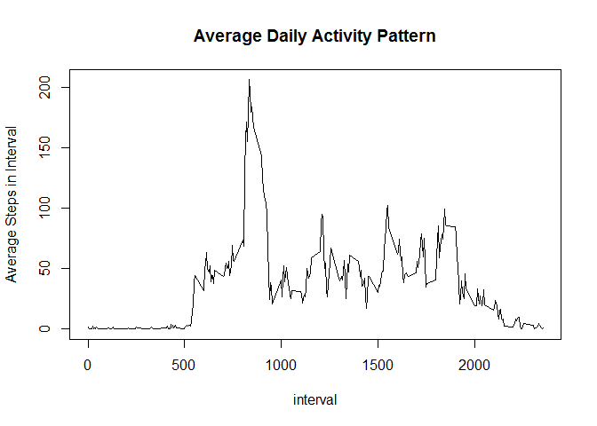
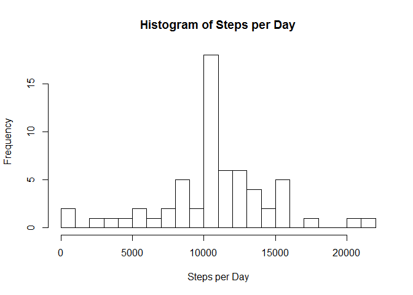
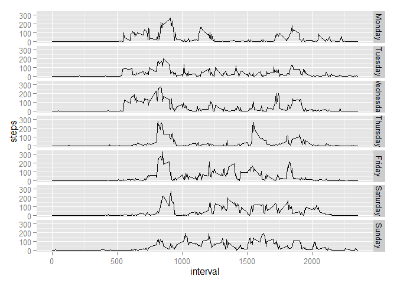

# Reproducible Research: Peer Assessment 1


## Loading and preprocessing the data

```r
unzip("activity.zip")
activity <- read.csv("activity.csv")
head(activity)
```

```
##   steps       date interval
## 1    NA 2012-10-01        0
## 2    NA 2012-10-01        5
## 3    NA 2012-10-01       10
## 4    NA 2012-10-01       15
## 5    NA 2012-10-01       20
## 6    NA 2012-10-01       25
```

## What is mean total number of steps taken per day?

```r
library(dplyr)
```

```
## Warning: package 'dplyr' was built under R version 3.2.2
```

```
## 
## Attaching package: 'dplyr'
## 
## The following objects are masked from 'package:stats':
## 
##     filter, lag
## 
## The following objects are masked from 'package:base':
## 
##     intersect, setdiff, setequal, union
```

```r
head(table(activity$date))
```

```
## 
## 2012-10-01 2012-10-02 2012-10-03 2012-10-04 2012-10-05 2012-10-06 
##        288        288        288        288        288        288
```

```r
bydate <- group_by(activity, date)
step_per_day <- summarize(bydate, steps=sum(steps))
mean(step_per_day$steps, na.rm=TRUE)
```

```
## [1] 10766.19
```

```r
median(step_per_day$steps, na.rm=TRUE)
```

```
## [1] 10765
```
  
The mean of the total steps taken per day is 10,766.19.  
The median of the total steps taken per day is 10,765.

## What is the average daily activity pattern?

```r
head(table(activity$interval))
```

```
## 
##  0  5 10 15 20 25 
## 61 61 61 61 61 61
```

```r
byinterval <- group_by(activity, interval)
step_by_interval <- summarize(byinterval, steps=mean(steps, na.rm=TRUE))
plot(step_by_interval, type="l", ylab="Average Steps in Interval",
     main="Average Daily Activity Pattern")
```

 

```r
step_by_interval[step_by_interval$steps == max(step_by_interval$steps), ]
```

```
## Source: local data frame [1 x 2]
## 
##   interval    steps
##      (int)    (dbl)
## 1      835 206.1698
```

```r
step_by_interval[65:80,]
```

```
## Source: local data frame [16 x 2]
## 
##    interval     steps
##       (int)     (dbl)
## 1       520  3.320755
## 2       525  2.962264
## 3       530  2.094340
## 4       535  6.056604
## 5       540 16.018868
## 6       545 18.339623
## 7       550 39.452830
## 8       555 44.490566
## 9       600 31.490566
## 10      605 49.264151
## 11      610 53.773585
## 12      615 63.452830
## 13      620 49.962264
## 14      625 47.075472
## 15      630 52.150943
## 16      635 39.339623
```
  
- activities start between 5am and 6am.  
- the interval with the max average steps is 8:35am.

## Imputing missing values
Where steps is missing, the average steps for that particular interval (calcuated above)
were used.

```r
table(is.na(activity$steps))
```

```
## 
## FALSE  TRUE 
## 15264  2304
```

```r
#step_by_interval$interval <- as.factor(step_by_interval$interval)
#activity$interval <- as.factor(activity$interval)
imactivity <- merge(activity, step_by_interval, by.x="interval", by.y="interval" )
imactivity$steps.x[is.na(imactivity$steps.x)] <- 
    imactivity$steps.y[is.na(imactivity$steps.x)]
bydate <- group_by(imactivity, date)
step_per_day <- summarize(bydate, steps=sum(steps.x))    
hist(step_per_day$steps, breaks=20, main="Histogram of Steps per Day", 
     xlab = "Steps per Day")
```

 

```r
mean(step_per_day$steps)
```

```
## [1] 10766.19
```

```r
median(step_per_day$steps)
```

```
## [1] 10766.19
```

## Are there differences in activity patterns between weekdays and weekends?

```r
imactivity$weekdays <- as.factor(weekdays(as.Date(imactivity$date)))
imactivity$weekdays <- factor(imactivity$weekdays, levels(imactivity$weekdays)[c(2,6,7,5,1,3,4)])
table(imactivity$weekdays)
```

```
## 
##    Monday   Tuesday Wednesday  Thursday    Friday  Saturday    Sunday 
##      2592      2592      2592      2592      2592      2304      2304
```

```r
byweekdays <- group_by(imactivity, weekdays, interval)
step_by_iw <- summarize(byweekdays, steps=mean(steps.x))
library(ggplot2)
```

```
## Warning: package 'ggplot2' was built under R version 3.2.2
```

```r
qplot(interval, steps, data=step_by_iw, facets=weekdays~., geom=c("line"))
```

 
  
- There are not significant different between weekdays and weekends.    
- It appears that walking activities start later after Thursday.  
- Monday appears to be the most active day of the week.  
- Sunday appears to be the less active day of the week.  
